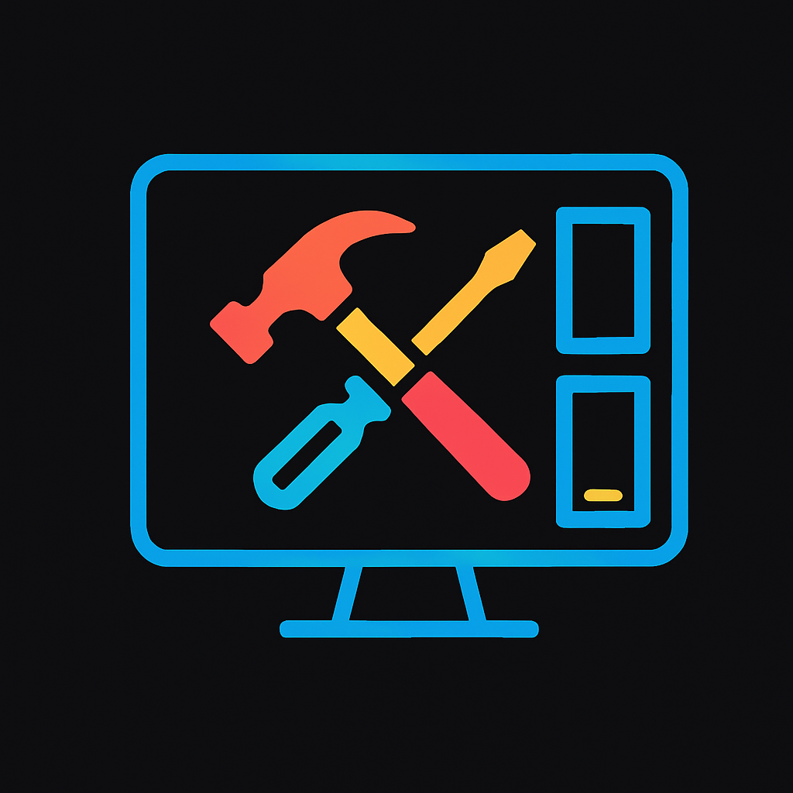

# Herald Builds - PC Building Guide Platform



## 🚀 Project Overview

Herald Builds is a comprehensive web platform designed to guide users through every step of building the perfect PC. From selecting components to troubleshooting issues, our platform provides detailed guides, tools recommendations, and expert advice for PC builders of all skill levels.

## ✨ Features

### 🎯 Core Features
- **Step-by-Step PC Building Guides** - Comprehensive tutorials for beginners to advanced builders
- **Interactive Troubleshooting System** - Diagnose and solve common PC issues
- **Tools & Components Database** - Curated recommendations for essential PC building tools
- **FAQ System** - Frequently asked questions with dynamic content management
- **Responsive Design** - Optimized for desktop, tablet, and mobile devices

### 🔧 Technical Features
- **React Router** - Single Page Application with smooth navigation
- **Dynamic Content Loading** - Real-time updates from admin backend
- **Auto-refresh System** - Keeps content synchronized with latest updates
- **Search Functionality** - Find guides and content quickly
- **Category Filtering** - Organize content by difficulty level and type

## 🛠️ Technology Stack

### Frontend
- **React 18.3.1** - Modern React with hooks and functional components
- **React Router DOM 6.30.1** - Client-side routing
- **FontAwesome Icons** - Professional iconography
- **CSS3** - Custom styling with modern features
- **JavaScript ES6+** - Modern JavaScript features

### Development Tools
- **Create React App** - Development environment and build tools
- **React Scripts 5.0.1** - Build and development scripts
- **Testing Library** - Comprehensive testing suite

### Backend Integration
- **PHP APIs** - Backend services for dynamic content
- **MySQL Database** - Data storage and management
- **RESTful APIs** - Clean API architecture

## 📁 Project Structure

```
heraldbuilds/
├── public/
│   ├── index.html
│   ├── main-logo.png
│   ├── favicon.ico
│   └── guides.json
├── src/
│   ├── components/
│   │   └── pages/
│   │       ├── About.jsx
│   │       ├── FAQ.jsx
│   │       ├── GuidesPage.jsx
│   │       ├── GuideDetails.jsx
│   │       ├── Header.jsx
│   │       ├── Footer.jsx
│   │       ├── Home.jsx
│   │       ├── ToolsPage.jsx
│   │       ├── TroubleshootingPage.jsx
│   │       └── Styles/
│   │           ├── index.css
│   │           ├── GuideDetails.css
│   │           ├── GuidesPage.css
│   │           ├── faq.css
│   │           └── tools-styles.css
│   ├── hooks/
│   ├── App.js
│   ├── App.css
│   └── index.js
├── package.json
├── package-lock.json
└── README.md
```

## 🚀 Getting Started

### Prerequisites
- **Node.js** (version 14 or higher)
- **npm** (comes with Node.js)
- **Git** (for version control)

### Installation

1. **Clone the repository**
   ```bash
   git clone <repository-url>
   cd HeraldBuilds/heraldbuilds
   ```

2. **Install dependencies**
   ```bash
   npm install
   ```

3. **Start the development server**
   ```bash
   npm start
   ```

4. **Open your browser**
   Navigate to [http://localhost:3000](http://localhost:3000)

### Available Scripts

- `npm start` - Runs the app in development mode
- `npm test` - Launches the test runner
- `npm run build` - Builds the app for production
- `npm run eject` - Ejects from Create React App (one-way operation)

## 📱 Pages & Features

### 🏠 Home Page
- Hero section with animated title
- Feature highlights
- Benefits overview
- User testimonials
- Dream PC showcase

### 📚 Guides Page
- Categorized by skill level (Beginner, Intermediate, Advanced, Expert)
- Search functionality
- Dynamic loading from admin backend
- Detailed guide information with step-by-step instructions

### 🔧 Tools Page
- Essential PC building tools
- Hardware recommendations
- Safety tips and best practices
- Component specifications

### ❓ FAQ Page
- Dynamic FAQ system
- Category filtering
- User question submission
- Auto-refresh functionality
- Backend integration

### 🛠️ Troubleshooting Page
- Common PC issues and solutions
- Symptom-based diagnosis
- Step-by-step resolution guides
- Severity indicators

### ℹ️ About Page
- Company information
- Mission and values
- Team details
- Contact information

## 🎨 Design Features

### Visual Elements
- **Modern Dark Theme** - Professional appearance with blue accents
- **Responsive Grid Layouts** - Adapts to all screen sizes
- **Smooth Animations** - Enhanced user experience
- **Glowing Text Effects** - Eye-catching hero elements
- **Card-based Design** - Clean, organized content presentation

### User Experience
- **Intuitive Navigation** - Easy-to-use menu system
- **Search & Filter** - Quick content discovery
- **Progressive Enhancement** - Works without JavaScript
- **Accessibility** - Screen reader friendly
- **Mobile-First** - Optimized for mobile devices

## 🔌 Backend Integration

### API Endpoints
- `GET /apis/guides/get.php` - Fetch guides from admin
- `GET /apis/faqs/get.php` - Fetch FAQ items
- `POST /apis/user-questions/submit.php` - Submit user questions

### Data Management
- **Local Storage** - Fallback for offline functionality
- **Auto-refresh** - Real-time content updates
- **Error Handling** - Graceful degradation when backend unavailable

## 🧪 Testing

Run the test suite:
```bash
npm test
```

The project includes:
- Component testing with React Testing Library
- DOM testing utilities
- User event simulation
- Jest test runner

## 📦 Building for Production

1. **Create production build**
   ```bash
   npm run build
   ```

2. **Deploy the `build` folder** to your web server

The build is optimized and minified for best performance.

## 🌐 Deployment

### Recommended Hosting Platforms
- **Netlify** - Automatic deployments from Git
- **Vercel** - Optimized for React applications
- **GitHub Pages** - Free hosting for static sites
- **AWS S3** - Scalable cloud hosting

### Environment Setup
1. Set up backend APIs on your server
2. Update API endpoints in the code
3. Configure CORS for cross-origin requests
4. Set up database connections

## 🤝 Contributing

### Development Workflow
1. Fork the repository
2. Create a feature branch (`git checkout -b feature/amazing-feature`)
3. Commit your changes (`git commit -m 'Add amazing feature'`)
4. Push to the branch (`git push origin feature/amazing-feature`)
5. Open a Pull Request

### Code Style
- Use functional components with hooks
- Follow React best practices
- Maintain consistent CSS naming conventions
- Add comments for complex logic
- Write tests for new features

## 📄 License

This project is licensed under the MIT License - see the [LICENSE](LICENSE) file for details.

## 👥 Team

**Herald Builds Development Team**
- Frontend Development
- UI/UX Design
- Backend Integration
- Quality Assurance

## 📞 Support

### Contact Information
- **Email**: supportcentre@heraldbuilds.com
- **Phone**: +254 748913742
- **Address**: 224, Madaraka, Nairobi, Kenya
- **Support Hours**: Monday–Friday, 9AM–6PM EAT

### Getting Help
1. Check the FAQ section
2. Search existing issues
3. Create a new issue with detailed description
4. Contact support for urgent matters

## 🔄 Version History

### v0.1.0 (Current)
- Initial release
- Core functionality implemented
- Responsive design
- Backend integration
- FAQ system
- Guide management

## 🎯 Future Enhancements

### Planned Features
- **User Accounts** - Personal build tracking
- **Build Calculator** - Component compatibility checker
- **Community Forum** - User discussions
- **Video Integration** - Embedded tutorials
- **Mobile App** - Native mobile experience
- **AI Assistant** - Intelligent troubleshooting

### Technical Improvements
- **Performance Optimization** - Faster loading times
- **SEO Enhancement** - Better search engine visibility
- **Accessibility** - WCAG compliance
- **Internationalization** - Multi-language support

## 📊 Analytics & Monitoring

### Performance Metrics
- Page load times
- User engagement
- Search functionality usage
- Guide completion rates

### Error Tracking
- JavaScript error monitoring
- API failure tracking
- User experience issues

---

**Built with ❤️ by the Herald Builds Team**

*Empowering PC builders worldwide with comprehensive guides and expert knowledge.*